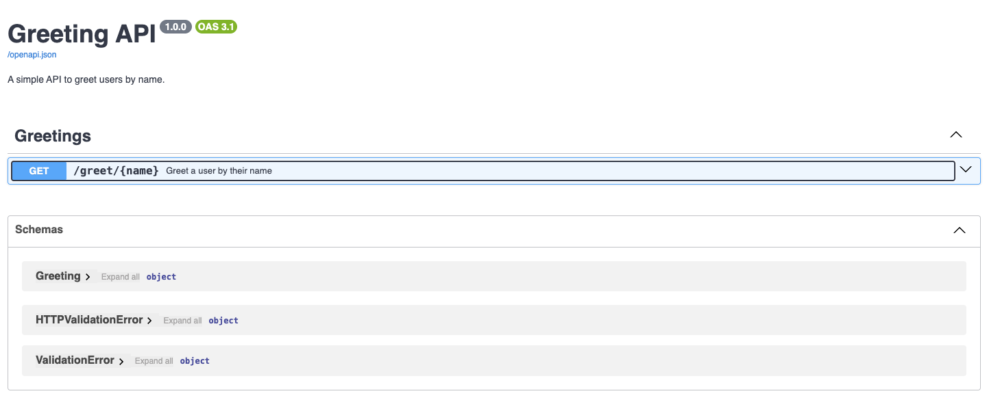
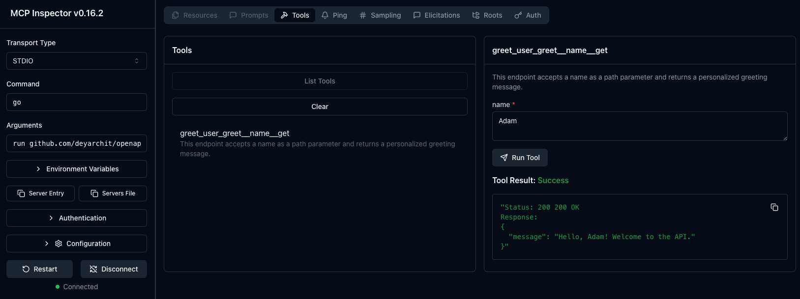

# OpenAPI Spec to MCP Generator

A utility for serving api service with openapi v3 spec as a mcp server. The goal of this utility is to remain agonstic of the API implementation and purely rely on the openapi v3 spec to build the MCP server.

## Running the app

### Running it for your API

Make sure you have [go](https://go.dev/doc/install) installed and then run the command as shown below:

`go run github.com/deyarchit/openapi-mcp-generator/cmd/mcp-server-cli@latest --spec-file=<open_api_spec_json>`

Add the config to the mcp config file `~/.mcp_config`:
```
{
  "mcpServers": {
    "demo-server": {
        "command": "go",
        "args": [
          "run",
          "github.com/deyarchit/openapi-mcp-generator/cmd/mcp-server-cli@latest",
            "--spec-file=<open_api_spec_json>"
        ] 
    }
  }
}
```

```bash
▶ npx @modelcontextprotocol/inspector --config ~/.mcp_config --server <config_dict_name>
Starting MCP inspector...
⚙️ Proxy server listening on localhost:6277
.
.
.
🌐 Opening browser...
New STDIO connection request
.
.
.
STDIO transport: command=/opt/homebrew/opt/go@1.23/bin/go, args=run,github.com/deyarchit/openapi-mcp-generator/cmd/mcp-server-cli@latest,--spec-file=<open_api_spec_json>
Created server transport
Created client transport
Received POST message for sessionId 4c899e13-8c00-4b38-9e8e-62b4933ad87b
Received POST message for sessionId 4c899e13-8c00-4b38-9e8e-62b4933ad87b
Received POST message for sessionId 4c899e13-8c00-4b38-9e8e-62b4933ad87b
Received POST message for sessionId 4c899e13-8c00-4b38-9e8e-62b4933ad87b
Received POST message for sessionId 4c899e13-8c00-4b38-9e8e-62b4933ad87b
Received POST message for sessionId 4c899e13-8c00-4b38-9e8e-62b4933ad87b
Received POST message for sessionId 4c899e13-8c00-4b38-9e8e-62b4933ad87b
Received POST message for sessionId 4c899e13-8c00-4b38-9e8e-62b4933ad87b
Received POST message for sessionId 4c899e13-8c00-4b38-9e8e-62b4933ad87b

```


### Running the example

Clone the repo and navigate to `example/python-fastapi-app`, run `uv run fastapi dev`:
- This will run a simple greetings API `http://127.0.0.1:8000`
- Serve the OpenAPI spec v3 on endpoint `http://127.0.0.1:8000/openapi.json`

The spec would look something like this:
```json
{"openapi":"3.1.0","info":{"title":"Greeting API","description":"A simple API to greet users by name.","version":"1.0.0"},"paths":{"/greet/{name}":{"get":{"tags":["Greetings"],"summary":"Greet a user by their name","description":"This endpoint accepts a name as a path parameter and returns a personalized greeting message.","operationId":"greet_user_greet__name__get","parameters":[{"name":"name","in":"path","required":true,"schema":{"type":"string","title":"Name"}}],"responses":{"200":{"description":"Successful Response","content":{"application/json":{"schema":{"$ref":"#/components/schemas/Greeting"}}}},"422":{"description":"Validation Error","content":{"application/json":{"schema":{"$ref":"#/components/schemas/HTTPValidationError"}}}}}}}},"components":{"schemas":{"Greeting":{"properties":{"message":{"type":"string","title":"Message"}},"type":"object","required":["message"],"title":"Greeting"},"HTTPValidationError":{"properties":{"detail":{"items":{"$ref":"#/components/schemas/ValidationError"},"type":"array","title":"Detail"}},"type":"object","title":"HTTPValidationError"},"ValidationError":{"properties":{"loc":{"items":{"anyOf":[{"type":"string"},{"type":"integer"}]},"type":"array","title":"Location"},"msg":{"type":"string","title":"Message"},"type":{"type":"string","title":"Error Type"}},"type":"object","required":["loc","msg","type"],"title":"ValidationError"}}}}
```

The docs endpoint `http://127.0.0.1:8000/docs` would look something like this:



Now, run the mcp inspector as shown below:

```bash
▶ npx @modelcontextprotocol/inspector go run github.com/deyarchit/openapi-mcp-generator/cmd/mcp-server-cli@latest --spec-url="http://127.0.0.1:8000/openapi.json"
Starting MCP inspector...
.
.
.
🌐 Opening browser...
New STDIO connection request
Query parameters: {"command":"go","args":"run github.com/deyarchit/openapi-mcp-generator/cmd/mcp-server-cli@latest --spec-url=http://127.0.0.1:8000/openapi.json",...,"transportType":"stdio"}
STDIO transport: command=/opt/homebrew/opt/go@1.23/bin/go, args=run,github.com/deyarchit/openapi-mcp-generator/cmd/mcp-server-cli@latest,--spec-url=http://127.0.0.1:8000/openapi.json
Created server transport
Created client transport
Received POST message for sessionId ca89382a-02bc-48a0-b43d-367b56618af6
Received POST message for sessionId ca89382a-02bc-48a0-b43d-367b56618af6
Received POST message for sessionId ca89382a-02bc-48a0-b43d-367b56618af6
```

Head over to the MCP url and test the api:




If you already have existing mcp server configs then you can add this to the config file:
```
{
  "mcpServers": {
    "hello-world-server": {
        "command": "go",
        "args": [
            "run",
            "github.com/deyarchit/openapi-mcp-generator/cmd/mcp-server-cli@latest",
            "--spec-url=http://127.0.0.1:8000/openapi.json"
        ]
    }
  }
}

```
Then you can run the mcp inspector like this: `npx @modelcontextprotocol/inspector --config ~/.mcp_config --server hello-world-server`

## Recommendations

1. **Exposed APIs**: Be conscious of the number of API endpoints getting exposed to the LLM, appropriately evaluate which endpoints should be exposed to the LLM.
2. **API Documentation**: Think of LLMs as a new member on your team who doesn't have any of the tribal knowledge that you might have acquired while building and using your APIs. So, to improve the effectiveness of API use, thoroughly document the APIs including the arguments. This helps in reducing API call errors.

## WIP
- [ ] Support for API filtering (to selectively serve specific paths)
- [ ] Support for API auth
